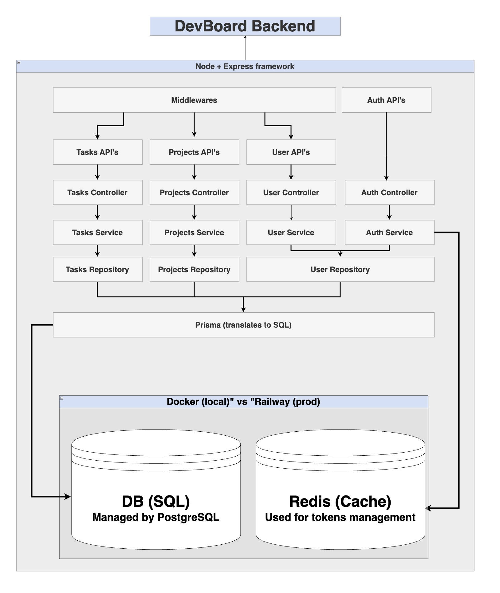

# DevBoard

A full-stack project management SaaS inspired by Jira and Linear — built as a flagship portfolio project.

---

## Tech Stack

### Frontend _(in progress)_

- React 18 + TypeScript
- Tailwind CSS
- Zustand (global state)
- TanStack Query (server state)
- React Router

### Backend

- Node.js + Express + TypeScript
- Prisma 7 (ORM)
- PostgreSQL (primary database)
- Redis (token blocklist for auth)
- Zod (request validation)
- JWT (access + refresh token auth)
- Swagger UI (`/api/docs`)

### Shared

- `@devboard/shared` — Zod schemas and TypeScript types shared between frontend and backend

### Infrastructure

- Docker Compose (local PostgreSQL + Redis)
- Railway (production backend)
- Vercel (production frontend)
- GitHub Actions (CI)

---

## Backend Architecture

The backend follows a strict layered architecture:

```
Request → Middleware → Route → Controller → Service → Repository → Prisma → PostgreSQL
                                                          ↓
                                                        Redis (auth only)
```



### Layers

| Layer          | Responsibility                                                      |
| -------------- | ------------------------------------------------------------------- |
| **Middleware** | Authentication (`authenticate.ts`) + Zod validation (`validate.ts`) |
| **Routes**     | Map HTTP method + path to controller, apply middleware              |
| **Controller** | Extract from `req`, call service, return HTTP response              |
| **Service**    | Business logic + authorization checks                               |
| **Repository** | All Prisma queries — no business logic                              |
| **Prisma**     | ORM — translates repository calls to SQL                            |

---

## API Overview

### Auth (`/api/auth`) — public

| Method | Endpoint             | Description                                |
| ------ | -------------------- | ------------------------------------------ |
| POST   | `/api/auth/register` | Register a new user                        |
| POST   | `/api/auth/login`    | Login, returns access + refresh tokens     |
| POST   | `/api/auth/logout`   | Invalidate refresh token (Redis blocklist) |
| POST   | `/api/auth/refresh`  | Issue new access token                     |

### Projects (`/api/projects`) — protected

| Method | Endpoint            | Description                        |
| ------ | ------------------- | ---------------------------------- |
| GET    | `/api/projects`     | Get all projects (owner or member) |
| GET    | `/api/projects/:id` | Get project by ID                  |
| POST   | `/api/projects`     | Create a new project               |
| PATCH  | `/api/projects/:id` | Update project (owner only)        |
| DELETE | `/api/projects/:id` | Delete project (owner only)        |

### Tasks (`/api/tasks`) — protected

| Method | Endpoint                  | Description                    |
| ------ | ------------------------- | ------------------------------ |
| GET    | `/api/tasks?projectId=`   | Get all tasks for a project    |
| GET    | `/api/tasks/:id`          | Get task by ID                 |
| POST   | `/api/tasks`              | Create a new task              |
| PATCH  | `/api/tasks/:id`          | Update task fields             |
| PATCH  | `/api/tasks/:id/status`   | Update task status             |
| PATCH  | `/api/tasks/:id/assignee` | Reassign task                  |
| DELETE | `/api/tasks/:id`          | Delete task (owner or creator) |

---

## Data Models

```prisma
model User        // id, email, name, role, password
model Project     // id, name, ownerId, status, members[], tasks[]
model Task        // id, title, description, status, priority, labels[], creatorId, assigneeId, projectId
model ProjectMember // userId, projectId, role
```

---

## Auth Flow

1. Register/Login → returns `accessToken` (15m) + `refreshToken` (7d)
2. All protected routes require `Authorization: Bearer <accessToken>`
3. On expiry → `POST /api/auth/refresh` with `refreshToken` → new `accessToken`
4. Logout → `refreshToken` added to Redis blocklist with TTL

---

## Running Locally

```bash
# 1. Start database and Redis
npm run db:up

# 2. Install dependencies
cd backend && npm install

# 3. Run migrations
npx prisma migrate dev

# 4. Start dev server
npm run dev

# API docs available at:
# http://localhost:3000/api/docs
```

---

## Project Structure

```
DevBoard/
├── backend/
│   ├── src/
│   │   ├── config/         # Prisma client
│   │   ├── controllers/    # Request handlers
│   │   ├── db/             # Redis client
│   │   ├── middleware/     # authenticate, validate
│   │   ├── repositories/   # Prisma queries
│   │   ├── routes/         # Express routers
│   │   ├── services/       # Business logic
│   │   └── types/          # Express type extensions
│   └── server.ts
├── frontend/               # React app (in progress)
├── shared/
│   └── types/              # Zod schemas + inferred TS types
└── docker-compose.yml
```

---

## Status

| Sprint     | Focus                                                          | Status     |
| ---------- | -------------------------------------------------------------- | ---------- |
| Sprint 1-3 | Architecture planning, monorepo setup, DB schema               | ✅ Done    |
| Sprint 4   | Full backend — Auth, Projects CRUD, Tasks CRUD, Zod validation | ✅ Done    |
| Sprint 5   | React frontend — routing, auth flow, project/task views        | 🔲 Up next |
